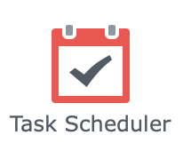
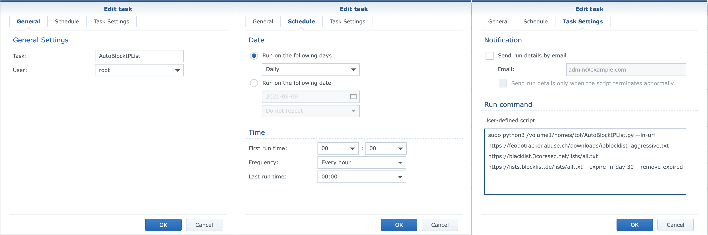

# AutoBlockIPList

> This script allows you to automate the update of the IP block list on the Synology NAS from a list of IP's _(custom user or external list)_.

_This script was only tested with Synology DSM 6 (6.2.4)_

---

### Table of contents
#### Usage

    AutoBlockIPList [-h] [-f [IN_FILE ...]] [-u [IN_URL ...]]
                           [-e EXPIRE_IN_DAY] [--remove-expired] [-b BACKUP_TO]
                           [--clear-db] [--dry-run] [-v] [--version]
    
    optional arguments:
    
    -h, --help            show this help message and exit
    
    -f [IN_FILE ...], --in-file [IN_FILE ...]
                        Local list file separated by a space (eg.
                        /home/user/list.txt custom.txt)
                        
    -u [IN_URL ...], --in-url [IN_URL ...]
                        External list url separated by a space (eg
                        https://example.com/list.txt
                        https://example.com/all.txt)
                        
    -e EXPIRE_IN_DAY, --expire-in-day EXPIRE_IN_DAY
                        Expire time in day. Default 0: no expiration
                        
    --remove-expired      Remove expired entry
    
    -b BACKUP_TO, --backup-to BACKUP_TO
                        Folder to store a backup of the database
                        
    --clear-db            Clear ALL deny entry in database before filling
    
    --dry-run             Perform a run without any modifications
    
    -v, --verbose         Increase output verbosity
    
    --version             show program's version number and exit

---

#### Requirements

In DSM 6, **install package python3**.

Connect to your NAS though SSH and execute following commands:

`sudo python3 -m ensurepip`

Go to AutoBlockIPList folder and run

`sudo python3 -m pip install -r requirements.txt`

---

#### First use
Before to run this script in your schedule tasks, perform some single run in SSH.

First one with `--backup-to` and `--dry-run` to get a backup of your database.

Next with `--in-file` or `--in-url` and `--dry-run`.

---
#### Synology DSM
##### Manual usage _(recommended for first use)_
- Connect to your NAS though SSH
- execute script like: `sudo python3 /volume1/scripts/AutoBlockIPList.py -v --dry-run --backup-to . --in-file /volume1/homes/user/custom.txt`

##### Schedule task

  - Go to Control Panel -> Task scheduler
  
  - Setting up the task
  
  
___

Enjoy :sunglasses: